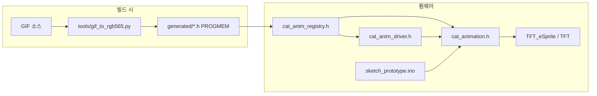

# OBDPet (sketch_prototype)


차량 **OBD-II**에서 읽은 속도(또는 그에 대응하는 값)에 따라 TFT 위 캐릭터 애니메이션이 바뀌는 대시보드형 IoT 펌웨어의 **Arduino/ESP32 프로토타입**입니다. macOS **RunCat**(부하에 따라 달리는 고양이)에서 아이디어를 가져와, 자동차 속도에 맞추는 방향으로 설계했습니다.

현재 저장소의 `sketch_prototype`은 **실제 OBD 블루투스 연동 전 단계**로, 시리얼 모니터에서 속도를 넣어 OBD를 흉내 내고, **GIF를 RGB565 `PROGMEM` 헤더로 빌드에 넣어** 재생합니다.

---

## 목차

1. [동작 요약](#동작-요약)
2. [아키텍처](#아키텍처)
3. [디렉터리 구조](#디렉터리-구조)
4. [하드웨어](#하드웨어)
5. [빌드·실행](#빌드실행)
6. [애니메이션 파이프라인 (GIF → C 헤더)](#애니메이션-파이프라인-gif--c-헤더)
7. [캐릭터 팩·플래시 절약 (`CAT_EMBED_PACK`)](#캐릭터-팩플래시-절약-cat_embed_pack)
8. [재생 규칙 (정지/주행 클립 선택)](#재생-규칙-정지주행-클립-선택)
9. [시리얼 명령](#시리얼-명령)
10. [설정 매크로 (`cat_anim_profile.h`)](#설정-매크로-cat_anim_profileh)
11. [트러블슈팅](#트러블슈팅)
12. [로드맵](#로드맵)

---

## 동작 요약

- **TFT_eSPI** + **TFT_eSprite**로 더블 버퍼링에 가깝게 그린 뒤 `pushSprite`로 화면에 올립니다.
- 애니메이션 데이터는 **파일시스템이 아니라** Python으로 생성한 **C 헤더 안의 `PROGMEM` 배열**입니다.
- 캐릭터는 `CatCharacterPack` 단위로 묶이며, 슬롯마다 `sleep` / `run` / (선택) `idle` / `error` 클립을 둘 수 있습니다.
- **내부 변수 `g_catAnimObdKmh`**(km/h로 간주)가 0 이하면 정지 계열, 0 초과면 주행 계열 클립을 우선합니다. `sketch_prototype.ino`는 시리얼로 받은 속도를 이 값에 반영합니다.
- 프레임 간격은 속도에 따라 `map`으로 짧아지게 해 두었습니다(느리면 느리게, 빠르면 빠르게 넘김).

---

## 아키텍처



- **`cat_anim_types.h`**: `CatAnimAsset`, `CatAnimSlot`, `CatCharacterPack` 정의.
- **`cat_anim_registry.h`**: 생성된 헤더를 include하고, `kCatCharacters[]`에 각 팩의 슬롯 포인터를 연결. `CAT_EMBED_PACK`에 따라 포함 캐릭터가 달라집니다.
- **`cat_anim_profile.h`**: 플래시 팩 선택, 색 보정, 레이아웃( contain/cover ), 디폴트 캐릭터 등 **빌드 타임 튜닝**.
- **`cat_anim_driver.h`**: `g_catAnimObdKmh`와 로드된 슬롯 수에 따라 **어떤 `CatAnimAsset*`을 재생할지** 결정.
- **`cat_anim_picker.h`**: 시리얼에서 캐릭터/클립 선택, 목록 출력.
- **`cat_animation.h`**: 현재 에셋 조회, 프레임 인덱스, RGB565 픽셀 스케일·그리기(`drawPixel` 또는 옵션의 `pushImage` 버퍼).
- **`sketch_prototype.ino`**: 디스플레이 초기화, 스프라이트 생성(RAM 부족 시 축소 폴백), 시리얼 루프, HUD(`Speed:xxx`).

---

## 디렉터리 구조

| 경로 | 설명 |
|------|------|
| `sketch_prototype.ino` | 엔트리 스케치 |
| `cat_anim_*.h`, `cat_animation.h`, `cat_layout.h` | 애니메이션·레지스트리·프로필 |
| `generated/<캐릭터_id>/` | `gif_to_rgb565.py`로 만든 `anim_*.h` (용량 큼) |
| `data/animations/` | 소스 GIF 배치 권장 위치, `ASSETS.txt`에 워크플로 문서 |
| `tools/gif_to_rgb565.py` | GIF → RGB565 헤더 변환기 (Pillow 필요) |

---

## 하드웨어

### BOM (예시)

| 부품 | 예시 |
|------|------|
| MCU | ESP32 (WROOM-32 등) |
| 디스플레이 | Waveshare 2.0" 240×320 ST7789 IPS |
| OBD2 (향후) | 블루투스 Classic SPP 어댑터 등 |

### ESP32 ↔ Waveshare 2.0" ST7789 (참고 배선)

| ESP32 | Waveshare |
|--------|-----------|
| GPIO 23 (MOSI) | SDA |
| GPIO 18 (SCK) | SCL |
| GPIO 2 | DC |
| GPIO 15 | CS |
| GPIO 4 | RST |
| 3.3V | VCC, BL |
| GND | GND |

실제 핀은 사용 중인 **TFT_eSPI `User_Setup.h`**와 일치해야 합니다. `sketch_prototype.ino` 주석에 적힌 것처럼, **물리 해상도·회전**이 설정과 다르면 화면 일부만 노이즈처럼 보일 수 있습니다.

---

## 빌드·실행

1. **Arduino IDE** 또는 **PlatformIO** 등으로 ESP32 보드 패키지 설치.
2. 라이브러리: **TFT_eSPI** (ST7789 등 보드에 맞게 `User_Setup.h` 설정).
3. 이 폴더를 스케치 폴더로 열고 `sketch_prototype.ino` 컴파일·업로드.
4. 시리얼 **115200** baud. 부팅 후 `TFT: WxH` 로그로 논리 해상도 확인.

---

## 애니메이션 파이프라인 (GIF → C 헤더)

`tools/gif_to_rgb565.py`는 GIF의 각 프레임을 지정 크기로 리사이즈한 뒤, 픽셀을 **RGB565**로 변환해 `PROGMEM` 배열과 프레임 포인터 테이블이 담긴 `.h` 파일을 생성합니다.

**의존성**: Python 3, `Pillow` (`pip install pillow`).

**예시** (`data/animations/ASSETS.txt`와 동일한 패턴):

```bash
python tools/gif_to_rgb565.py data/animations/nyan/sleep.gif generated/nyan/anim_nyan_sleep.h --width 112 --height 98
python tools/gif_to_rgb565.py data/animations/nyan/run.gif   generated/nyan/anim_nyan_run.h   --width 112 --height 98
```

- `--symbol`: 출력 C 심볼 접두어(미지정 시 파일명 기반으로 정제).
- `--resample`: `nearest`, `bilinear`, `bicubic`, `lanczos` (기본 `lanczos`).

생성 후 **`cat_anim_registry.h`**에 해당 헤더를 include하고 `CatAnimAsset`·`kCatCharacters[]` 한 줄을 추가해야 빌드에 반영됩니다. 자세한 슬롯 순서와 권장 폴더 레이아웃은 `data/animations/ASSETS.txt`를 참고하세요.

---

## 캐릭터 팩·플래시 절약 (`CAT_EMBED_PACK`)

`cat_anim_profile.h`의 `CAT_EMBED_PACK`과 `cat_anim_registry.h`의 `#if` 분기가 맞물립니다.

| 값 | 의미 |
|----|------|
| `0` | mario + nyan + cjemoj 전부 (개발용, 플래시 큼) |
| `1` | mario만 |
| `2` | nyan만 |
| `3` | cjemoj만 |

`#include`되지 않은 `generated/.../*.h`는 바이너리에 올라가지 않습니다. 배포용으로는 **팩 하나만 켜고** 해당 캐릭터 GIF만 변환해도 됩니다.

---

## 재생 규칙 (정지/주행 클립 선택)

로직은 `cat_anim_driver.h`의 `catAnimResolvePlayingAsset`에 정리되어 있습니다.

- 팩에 **로드된 슬롯이 1개뿐**이면: OBD 속도와 무관하게 그 클립만 반복.
- **2개 이상**이면:
  - **속도 ≤ 0**: `SLEEP` → `IDLE` → `RUN` → `ERROR` 순으로, 존재하는 첫 클립.
  - **속도 > 0**: `RUN` → `IDLE` → `SLEEP` → `ERROR` 순.

슬롯 enum 순서는 `cat_anim_types.h`의 `CatAnimSlot`을 따릅니다.

---

## 시리얼 명령

| 입력 | 동작 |
|------|------|
| `list` 또는 `clist` | 캐릭터·슬롯·현재 클립 파일명, OBD 흉내 속도 출력 |
| `c0`, `c1`, … | 캐릭터 인덱스 선택 후 애니메이션 리셋·다시 그리기 |
| `n0`, `n1`, … | 이전 API 호환: 캐릭터 인덱스 선택 |
| `n파일명.gif` | 해당 파일명(대소문자 무시)을 가진 클립이 속한 캐릭터로 전환. sleep/idle이면 내부 속도 0, 그 외 1로 힌트 |
| `-120` ~ `120` (정수 한 줄) | `currentSpeed`로 반영 후 `catAnimSetObdKmh`에 전달 (내부적으로 0~120으로 clamp) |

애니메이션 **프레임 레이트**는 속도가 높을수록 짧은 간격으로 `presentAnimFrame`이 호출되도록 `map` 되어 있습니다.

---

## 설정 매크로 (`cat_anim_profile.h`)

주요 항목만 요약합니다. 상세 주석은 헤더 파일을 참고하세요.

- **`CAT_EMBED_PACK`**: 위 표 참고.
- **`CAT_ANIM_SWAP_RB`**: R/B 채널 스왑. TFT_eSPI `TFT_RGB_ORDER`와 **이중 적용**되면 색이 어긋날 수 있어 보통 `0`부터 시도.
- **`CAT_ANIM_INVERT_COLORS`**, **`CAT_ANIM_DIM_PERCENT`**: 색 반전·전체 밝기(100=원본).
- **`CAT_ANIM_USE_PUSH_IMAGE`**: `0`이면 픽셀 단위 `drawPixel`, `1`이면 RAM에 전체 프레임을 채운 뒤 `pushImage` (RAM 2배 사용).
- **`CAT_ANIM_FIT_CONTAIN`**: `1`이면 비율 유지·레터박스, `0`이면 cover(중앙 크롭).
- **`CAT_ANIM_LETTERBOX_FROM_ANIM_BORDER`**: 레터박스 배경을 고정색 대신 **0번 프레임 모서리 평균색**에 가깝게.
- **`CAT_DEFAULT_CHARACTER_INDEX`**, **`CAT_DEFAULT_GIF_LEAF`**: 기본 캐릭터·파일명 힌트 (`CAT_EMBED_PACK` 1~3일 때 기본 인덱스는 0으로 재정의됨).

---

## 트러블슈팅

- **화면 오른쪽만 잡음·깨짐**: `User_Setup.h`의 `TFT_WIDTH` / `TFT_HEIGHT`가 패널 **물리 픽셀**과 맞는지, `setRotation` 후 `tft.width()/height()`가 기대와 같은지 확인 (`sketch_prototype.ino` 상단 주석 참고).
- **색이 바뀜(하늘색·노랑 뒤바뀜 등)**: `tft.setSwapBytes` / `sprite.setSwapBytes`와 **`CAT_ANIM_SWAP_RB`**, `TFT_RGB_ORDER` 조합을 `drawPixel` 모드에서 맞춘 뒤 `CAT_ANIM_USE_PUSH_IMAGE`에도 동일하게 적용.
- **스프라이트 생성 실패**: 로그 `Sprite fail (RAM 부족)`. 스케치는 스프라이트 크기를 단계적으로 줄이는 폴백이 있음. 해상도·`CAT_ANIM_USE_PUSH_IMAGE`·다른 RAM 사용을 점검.
- **플래시 부족**: `CAT_EMBED_PACK`으로 캐릭터 한 종만 넣기, GIF 해상도·프레임 수 줄이기.

---

## 로드맵

- [ ] Veepeak 등 OBD2 블루투스 페어링 후 실시간 속도를 `catAnimSetObdKmh`에 연결
- [ ] 실차 테스트
- [ ] SPIFFS/LittleFS 등으로 런타임 에셋 교체(선택)
- [ ] 모바일 앱·웹 설정 UI (별도 저장소 계획 시)

---

## 관련 문서

- 캐릭터 폴더 규칙, 레지스트리 수정 예: **`data/animations/ASSETS.txt`**

---

## English (short)

**OBDPet** is an ESP32 + TFT_eSPI firmware prototype: GIFs are converted offline to RGB565 headers in flash (`PROGMEM`), grouped as character packs with sleep/run (and optional) slots. Serial input simulates OBD speed; `catAnimResolvePlayingAsset` picks the clip. See sections above for build steps, `CAT_EMBED_PACK`, and serial commands.
